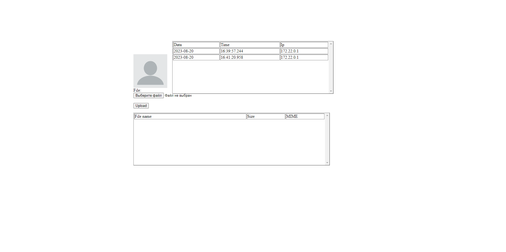
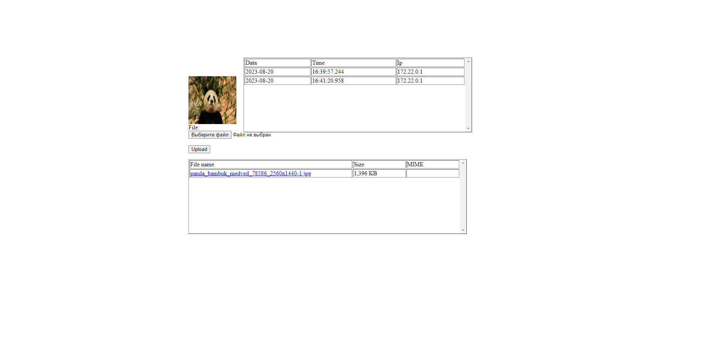

# FWA (First Web Application)
This project is part of the Java branch of School21.
This is a web application prototype developed using the Java Servlet API stack.
The application automates the booking business process of a movie theater.
The current version of the application implements registration and authentication mechanisms.
In this project, the use of Spring MVC and Hibernate components is prohibited (repository layer shall be implemented using JdbcTemplate).

## Features
A prototype web application with the Java Servlet API stack.

- User registration: Users can register by providing their first name, last name, phone number, and password. Passwords are encrypted using BCrypt.
- User authentication: Users can sign in using their email and password. Successful authentication generates an HttpSession object with user data.
- Profile page: Authenticated users have access to a profile page displaying their details and previous authentication information.
- Avatar upload: Users can upload their avatar image, which is saved with a unique file name.

## Usage

- Access the registration page by visiting /signUp URL.
- Access the login page by visiting /signIn URL.
- After registration or login, users are redirected to the profile page (/profile).
- View uploaded images and authentication details on the profile page.

## Installation

1. Clone the repository.
2. Configure application.properties with database connection details.
3. Build and deploy the application to a Java Servlet container.
4. Access the application using the appropriate URL.

## Commands to run

Using Maven
```
docker run --name pg-13.3 -p 5432:5432 -e POSTGRES_USER=postgres -e POSTGRES_PASSWORD=postgres -e POSTGRES_DB=cinema_db -d postgres:13.3
mvn clean package org.codehaus.cargo:cargo-maven2-plugin:run
```

Using docker-compose
```
docker-compose up -d --build
```

## Entrypoint for a website
```
localhost:8080
```

<details>
<summary>Screenshots</summary>
<details>
<summary>SignUp</summary>

</details>
<details>
<summary>SignIn</summary>

</details>
<details>
<summary>Default Profile</summary>

</details>
<details>
<summary>Profile with avatar</summary>

</details>
</details>
